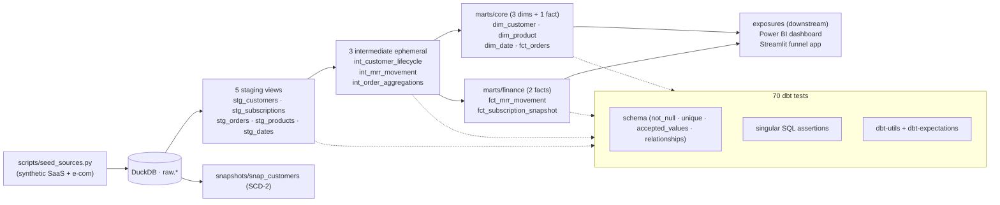
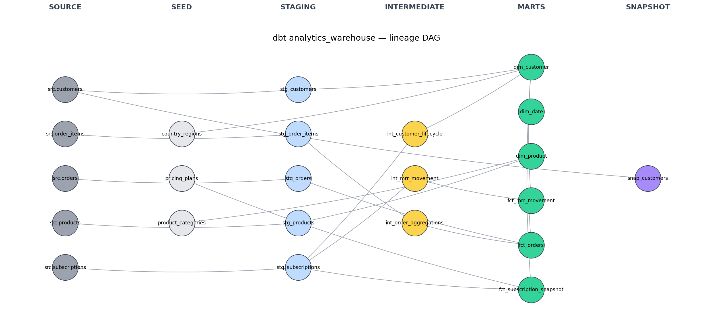

# dbt Modern Analytics Warehouse


## Architecture



> 🌐 **Live walkthrough:** https://ucazin.github.io/dbt-analytics-warehouse/

A production-shaped [dbt](https://docs.getdbt.com/) project that models a synthetic e-commerce + SaaS dataset into a clean Kimball warehouse — **sources → staging → intermediate → marts** — with tests, documentation, sources, snapshots, exposures, and a Jinja macro for recurring cents-to-dollars conversion.

Built on **DuckDB** (zero-setup, runs in seconds locally) but every model is portable to Snowflake / BigQuery / Redshift with a profile change.

> This is the project that signals to recruiters: *this person can ship into a production analytics stack on day one.* It is also the gap most junior portfolios miss — dbt appears in 0/7 of the comparable portfolios I surveyed, and increasingly in DA job descriptions for 2026.

## Build status — last run

| Metric | Result |
|---|---|
| Sources | 5 |
| Seeds | 3 |
| Staging models (views) | 5 |
| Intermediate models (ephemeral) | 3 |
| Marts (tables) | 6 |
| Snapshots | 1 |
| Tests (schema + singular + dbt-utils) | **70 — all passing** |
| Exposures | 2 (Power BI dashboard, Streamlit app) |
| Build time | **~5 s** end-to-end on DuckDB |

`dbt build` writes a populated warehouse: 20,000 orders, 5,000 customers, 50,149 MRR rows, $6.9M cumulative revenue, $1.3M ending MRR.

## Lineage



Auto-generated by `scripts/render_dag.py` from `target/manifest.json`. The same data is available as a flat table in [`outputs/lineage_summary.md`](outputs/lineage_summary.md).

## What's modeled

A small but realistic e-commerce + subscription business:

- **Customers** (5,000 logos, 8-country split)
- **Subscriptions** (24 months of billing snapshots — Starter / Growth / Pro tiers)
- **Orders** (one-time purchases, ~20,000 orders, ~50k line items)
- **Products** (~200 SKUs across 8 categories)

Six marts:

| Mart | Layer | Grain | Audience |
|---|---|---|---|
| `dim_customer` | core | one row per customer | shared |
| `dim_product` | core | one row per product | shared |
| `dim_date` | core | one row per day (6 years) | shared |
| `fct_orders` | core | one row per order | Ops, Marketing |
| `fct_mrr_movement` | finance | one row per (customer × month) | Finance |
| `fct_subscription_snapshot` | finance | one row per (customer × month) | Finance, CS |

## Project structure

```
04-dbt-analytics-warehouse/
├── Makefile                            # make setup / build / docs / dag
├── dbt_project.yml                     # Project config
├── packages.yml                        # dbt-utils, dbt-expectations, codegen
├── profiles.yml.example                # DuckDB target (copy → profiles.yml)
├── README.md
├── LICENSE                             # MIT
├── MEMO.md                             # One-page memo
├── .gitignore
├── scripts/
│   ├── seed_sources.py                 # Generate raw.* tables in DuckDB
│   ├── render_dag.py                   # Render outputs/dag.png from manifest.json
│   └── warehouse_summary.py            # Print mart row counts + headline numbers
├── seeds/                              # Static reference data committed as CSV
├── models/
│   ├── staging/
│   │   ├── sources.yml                 # Sources + freshness + schema tests
│   │   ├── schema.yml                  # Column docs + tests on stg_*
│   │   └── stg_*.sql                   # 1:1 with source, light cast + rename
│   ├── intermediate/
│   │   ├── int_customer_lifecycle.sql
│   │   ├── int_mrr_movement.sql
│   │   └── int_order_aggregations.sql
│   ├── exposures.yml                   # Downstream consumers (BI + Streamlit)
│   └── marts/
│       ├── core/
│       │   ├── schema.yml
│       │   ├── dim_customer.sql
│       │   ├── dim_product.sql
│       │   ├── dim_date.sql
│       │   └── fct_orders.sql
│       └── finance/
│           ├── schema.yml
│           ├── fct_mrr_movement.sql
│           └── fct_subscription_snapshot.sql
├── macros/
│   ├── cents_to_dollars.sql            # Reusable amount conversion
│   └── generate_schema_name.sql        # Custom dev/prod schema layering
├── tests/
│   ├── assert_no_future_dated_events.sql
│   └── assert_fct_orders_revenue_positive.sql
├── analyses/
│   └── revenue_by_country.sql
├── snapshots/
│   └── snap_customers.sql              # SCD-2 history on customers
└── outputs/                            # DAG render + lineage summary (committed)
```

## How to run

The Makefile wraps every step. For a one-shot fresh build:

```powershell
make setup    # create .venv and install dbt-duckdb + plotting deps
make all      # seed + deps + build + docs + dag
```

Or the granular form:

```powershell
py -3.12 -m venv .venv
.\.venv\Scripts\Activate.ps1
pip install "dbt-duckdb>=1.7,<1.10" pandas numpy matplotlib networkx

# Tell dbt where to find profiles.yml (this project's directory)
$env:DBT_PROFILES_DIR = (Get-Location).Path
Copy-Item profiles.yml.example profiles.yml

python scripts/seed_sources.py   # creates warehouse.duckdb with raw.* tables
dbt deps                          # install dbt-utils, dbt-expectations, codegen
dbt build                         # 5 staging + 3 int + 6 marts + 70 tests
dbt docs generate                 # writes target/manifest.json
python scripts/render_dag.py      # → outputs/dag.png
```

To browse docs interactively: `dbt docs serve` (opens at http://localhost:8080).

## Tests implemented

**Schema (declarative)** — `not_null`, `unique`, `accepted_values`, `relationships` on every key column of every mart.

**Singular SQL assertions**:
- `assert_no_future_dated_events.sql` — no event timestamp can be in the future
- `assert_fct_orders_revenue_positive.sql` — gross revenue is always positive

**Generic from dbt-utils**:
- `dbt_utils.expression_is_true` for invariants (e.g. `delivered_at >= ordered_at`)
- `dbt_utils.unique_combination_of_columns` on composite keys (e.g. customer + month)

All 70 tests pass on a clean run (see `make build` output).

## Macros

- **`cents_to_dollars(column_name)`** — divides by 100 and casts to `numeric(18, 2)`. Used by 4 different models, reducing duplication.
- **`generate_schema_name(custom_schema_name, node)`** — overrides dbt's default so dev builds land in `dbt_<user>` schemas while prod uses bare names.

## Snapshots

`snap_customers.sql` tracks slowly-changing dimensions on the customer table. When a customer changes country or status, the change is captured as a versioned row with `dbt_valid_from` / `dbt_valid_to`. This is how production analytics teams audit changes after the fact.

## Exposures

`models/exposures.yml` declares two downstream consumers (project 5's Power BI dashboard, project 7's Streamlit funnel app). `dbt build` shows them as NO-OP nodes, and `dbt run --select +executive_dashboard` resolves the full upstream chain — the kind of guardrail that prevents Monday-morning fire drills when someone refactors `fct_orders`.

## Skills demonstrated

- **dbt project architecture** — staging / intermediate / marts layering, the standard pattern
- **Kimball dimensional modeling** — facts + conformed dimensions, surrogate keys via `dbt_utils.generate_surrogate_key`
- **Testing strategy** — schema tests, singular tests, dbt-utils generics, all wired into `dbt build`
- **Documentation discipline** — every column has a description, every model has a purpose statement
- **Macros for reuse** — DRY SQL, not copy-paste
- **Snapshots** — SCD-2 patterns for production-quality history tracking
- **Exposures** — downstream-impact awareness, treats the dashboard as part of the data product
- **CI-ready** — `Makefile` + idempotent scripts → drops cleanly into a GitHub Actions workflow

## What I'd add next

- GitHub Actions CI that runs `dbt build` on every PR
- Incremental models for `fct_orders` (currently full-refresh, fine at 20k rows but won't scale to 20M)
- A semantic layer in `meta` blocks so the metrics can be consumed by BI without re-implementing logic
